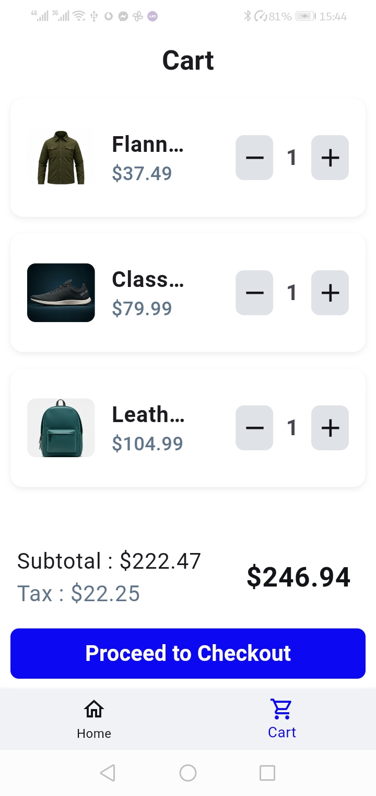
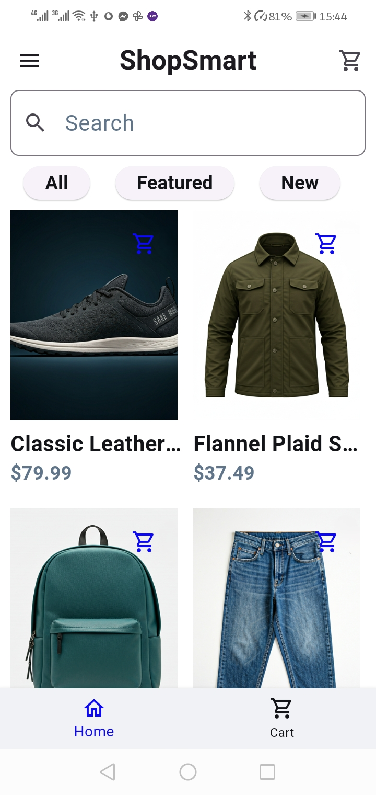
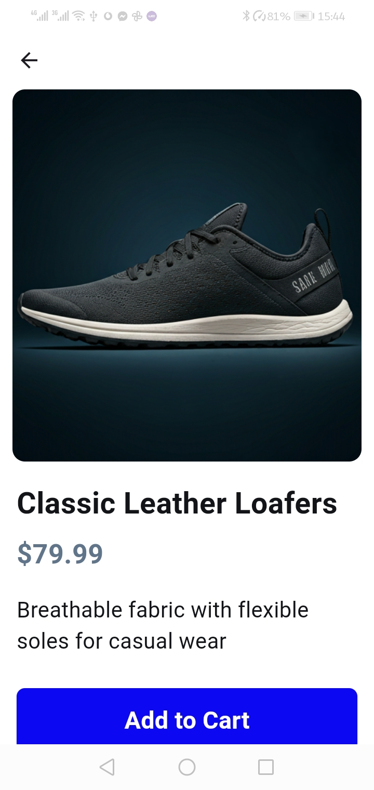

E_Commerce App
🚀 A modern and intuitive shopping app built with Flutter.

📌 Features
🛍️ Browse and search through a diverse product catalog

🛒 Add items to cart with quantity management

💾 Offline-ready with realistic sample data

🎨 Smooth and responsive UI with clean architecture

📱 Responsive design for all screen sizes

📸 Preview
🖼 Screenshots
 

🛠️ Built With
Flutter - Cross-platform framework

Dart - Programming language

Provider - State management

Custom Data Models - Clean architecture implementation

🔧 Architecture
Clean, modular code structure

Reusable widgets and components

Single source of truth for data management

Scalable foundation for future API integration

🚀 Getting Started
Prerequisites
Flutter SDK installed

Dart programming knowledge

Android Studio/VSCode with Flutter extension

Installation
Clone the repository

Run flutter pub get to install dependencies

Run flutter run to launch the app

📦 Package Highlights
Efficient state management with Provider

Responsive layout design

Realistic product data generation

Shopping cart functionality with persistence

🔮 Future Enhancements
Backend API integration

User authentication system

Payment gateway integration

Push notifications

Product reviews and ratings

🤝 Contributing
Feel free to fork this project and submit pull requests for any improvements!

📄 License
This project is open source and available under the MIT License.

⭐ Star this repo if you found it helpful!
